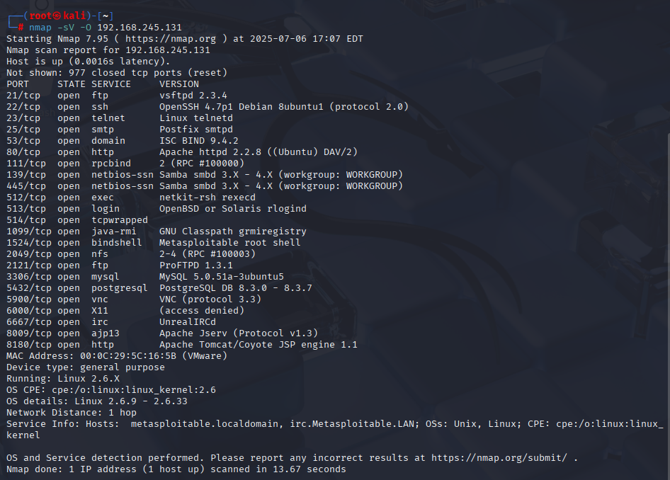

# Домашнее задание к занятию "Индексы"

### Задание 1
#### Скан виртуальной машины nmap

#### Сетевые службы разарешенные на хосте:
```
21	FTP	vsftpd 2.3.4
22	SSH	OpenSSH 4.7p1
23	Telnet	Linux telnetd
25	SMTP	Postfix smtpd
53	DNS	ISC BIND 9.4.2
80	HTTP	Apache 2.2.8
111	RPC	Portmapper
139	Samba/NetBIOS	Samba 3.x.x
445	Samba/NetBIOS	Samba 3.x.x
512	exec	netkit-rsh rexecd
513	login	OpenBSD rlogin
514	shell	OpenBSD rshd
1099	Java RMI	rmiregistry
1524	Bind Shell	Метасплойтабл шеловая дыра
2049	NFS	NFS v2-4
2121	FTP	ProFTPD 1.3.1
3306	MySQL	MySQL 5.0.51a
5432	PostgreSQL	8.3.0 - 8.3.7
5900	VNC	VNC protocol 3.3
6000	X11	(доступ разрешён)
6667	IRC	UnrealIRCd
8009	Apache JServ	AJP13 Protocol
8180	Apache Tomcat	JSP Engine 1.1
```


#### Популярные уязвимости, обнаруженные на хосте:
1. vsftpd 2.3.4 Backdoor доступ через FTP https://www.exploit-db.com/exploits/17491
2. PostgreSQL 8.3.6 подвержён удалённой уязвимости типа отказ в обслуживании (DoS) https://www.exploit-db.com/exploits/32849
3. Samba 3.5.0 - Remote Code Execution https://www.exploit-db.com/exploits/42060

### Задание 2
#### Сканирование Metasploitable в режимах SYN, FIN, Xmas, UDP
SYN	Полуоткрытое соединение (стелс) - ответ сервера: SYN-ACK или RST
FIN	Тихий FIN-пакет - ответ сервера: RST если закрыт, игнор если открыт
Xmas Маскировка пакета, похож на FIN - ответ сервера: Аналогично FIN
UDP	Без соединения, сложно определять - ответ сервера: ICMP ошибка или ответ UDP
